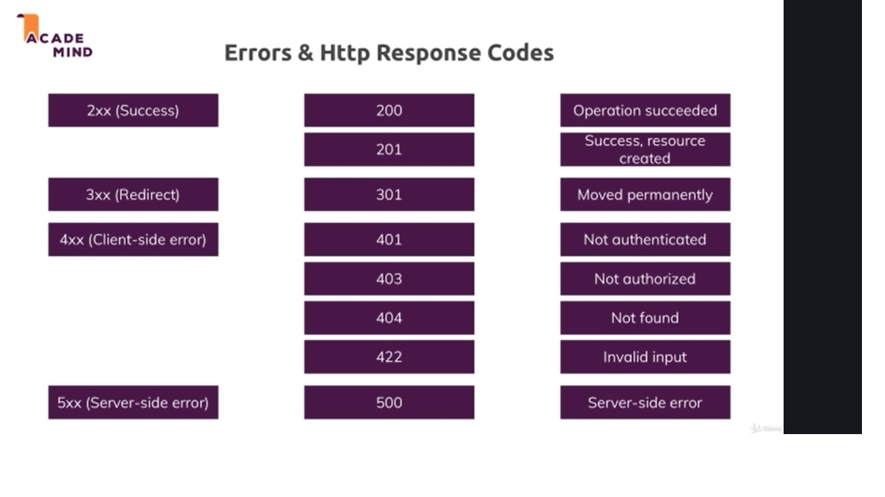
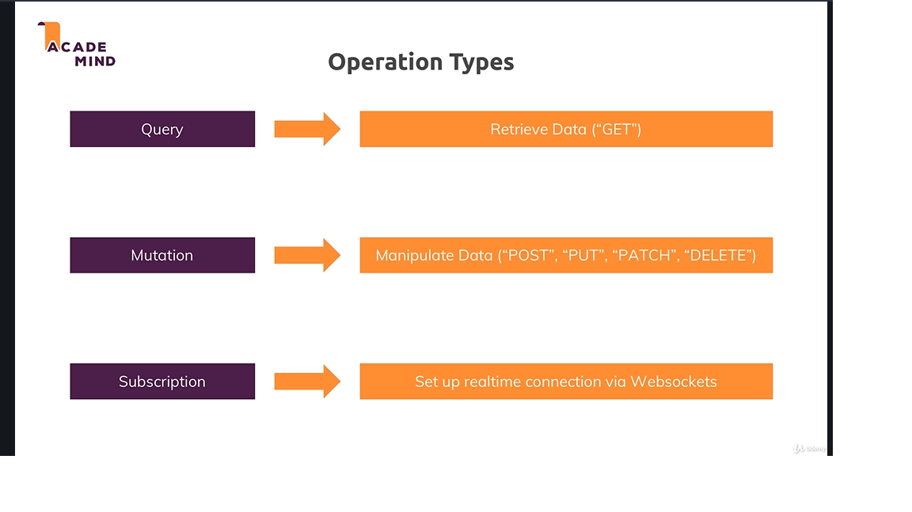
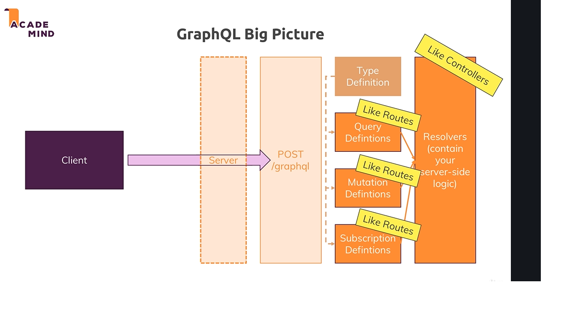

http://localhost:8080/graphql

# Note
 * difference between query and mutation :
    * In simple words the query is SELECT statement and mutation is INSERT Operation.
    Query in graphql is used to fetch data while mutation is used for INSERT/UPDATE/DELETE operation.

# 
   * 
 
   * 
 
   * 
 
